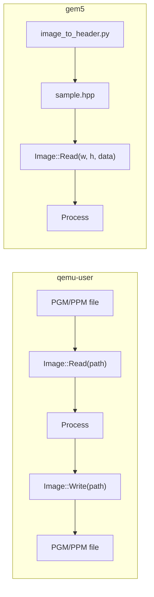

# Image I/O

How an `Image` gets its pixels depends on the target:

| | qemu-user (`*_qemu`) | gem5 (`*_gem5`) |
| --- | --- | --- |
| `Read` | From a PGM/PPM **file** via hosted libc | From an **embedded C++ header** (pixel array compiled into the binary) |
| `Write` | To a PGM/PPM file (binary P5/P6) | **Not supported** — no file I/O on the bare-metal runtime |



## qemu-user: file I/O

`Image::Read(const char* path)` and `Image::Write(const char* path)` are declared only when `RISCV_QEMU` is defined (all `*_qemu` targets).

```cpp
#ifdef RISCV_QEMU
Image<uint8_t> img;
img.Read("in.pgm");
#endif

// ... process ...

#ifdef RISCV_QEMU
img.Write("out.pgm");
#endif
```

For RGB:

```cpp
#ifdef RISCV_QEMU
Image<uint8_t, ImageType::RGB> img;
img.Read("in.ppm");
img.Write("out.ppm");
#endif
```

`Image::Read` reads the file header and **resizes the image** to the file's
dimensions (frees the old buffer and allocates a new one), `maxval` must be 255 and the file type (GRAY/RGB)
must match the `Image`'s `ImageType`.

### Formats

| Operation | GRAY | RGB |
| --- | --- | --- |
| `Read` | P2 (ASCII), P5 (binary) | P3 (ASCII), P6 (binary) |
| `Write` | P5 (binary) | P6 (binary) |

- `maxval` must be 255.
- On error (bad magic, size mismatch, short file), the guest prints to `stderr` and calls `abort()`.

Run under qemu-user so the guest can access the host filesystem (paths are as seen by the guest process):

```bash
cmake --build build --target run_Add_benchmark_qemu
```

### Where output files land

`Write` resolves **relative paths against the guest process's working
directory**, which the `run_*_qemu` targets set to that test's/benchmark's
build directory — not the repo root. So `Write("out.pgm")` from
`run_Add_test_qemu` creates `build/test/unit_test/out.pgm`. Use an absolute
path (e.g. `Write("/home/you/out.pgm")`) if you want a fixed location.

## gem5: embedded image headers

The gem5 bare-metal runtime has no file I/O (no `fopen` on klib), so images
are compiled into the binary as a C++ header. On gem5 targets,
`Image::Read(int width, int height, const uint8_t* data)` copies pixels from a
buffer instead of a file. **`Write` does not exist on gem5.**

### 1. Generate the header (on the host)

```bash
python3 scripts/image_to_header.py images/sample_640×426.pgm -o images/sample.hpp -s sample
```

This uses Pillow (`pip install Pillow`) and emits `sample_width`,
`sample_height`, `sample_channels`, and `sample_data[]`. Grayscale inputs stay
1 channel, color inputs become RGB (3 channels). The `images/` directory is on
the include path of the gem5 library, so headers placed there are found by
`#include "sample.hpp"`.

### 2. Read it in the test/benchmark

```cpp
#ifndef RISCV_QEMU
#include "sample.hpp"   // gem5 only: embedded pixel data
#endif

Image<uint8_t> img;
#ifndef RISCV_QEMU
img.Read(sample_width, sample_height, sample_data);
#endif
```

Like the qemu version, this `Read` **resizes the image** — the constructor
size is a placeholder and the buffer is reallocated to `width × height`.

For RGB images use `Image<uint8_t, ImageType::RGB>` and a header generated
from a color image (`*_channels == 3`); the pixel layout is interleaved
R,G,B, matching the qemu PPM path.

> **Note:** the pixel array is `constexpr` data compiled into the ELF, so a
> 640×426 grayscale image adds ~267 KB to the binary (and to the `.bin` loaded
> by gem5). Prefer small images for gem5 runs.
